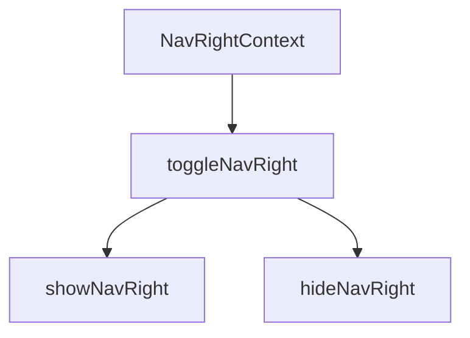
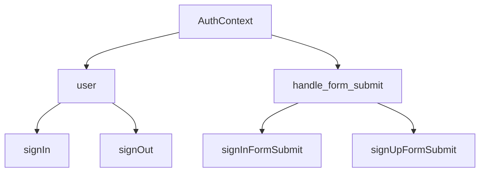
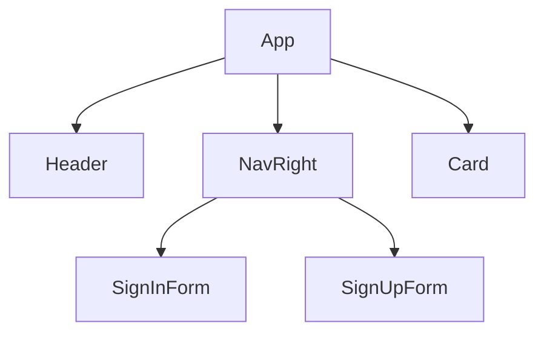

# Components flow

```mermaid
graph TD;
    NavRightContext --> toggleNavRight

    toggleNavRight --> showNavRight
    toggleNavRight --> hideNavRight
```

```mermaid
graph TD;
    AuthContext --> user
    AuthContext --> handle_form_submit
    
    user --> signIn
    user --> signOut

    handle_form_submit  --> signInFormSubmit
    handle_form_submit  --> signUpFormSubmit
```

```mermaid
graph TD;
    App --> Header
    App --> NavRight
    App --> Card

    NavRight --> SignInForm
    NavRight --> SignUpForm
```

