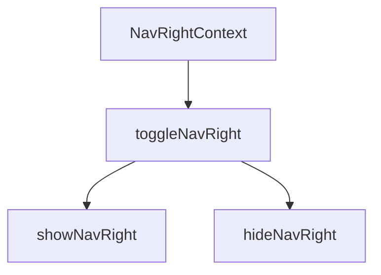
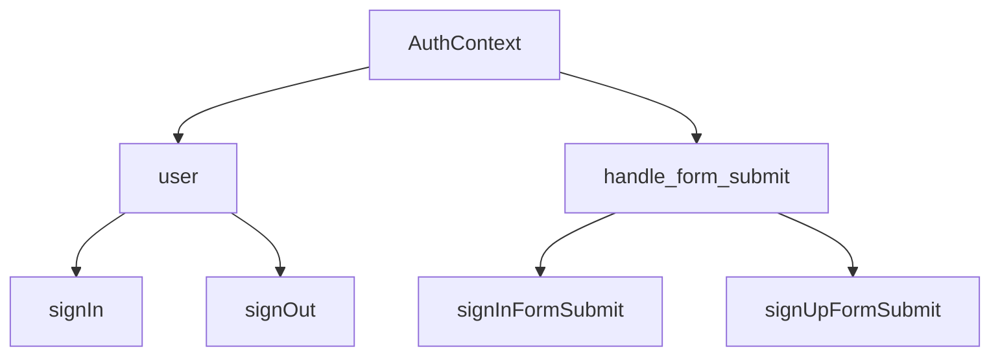
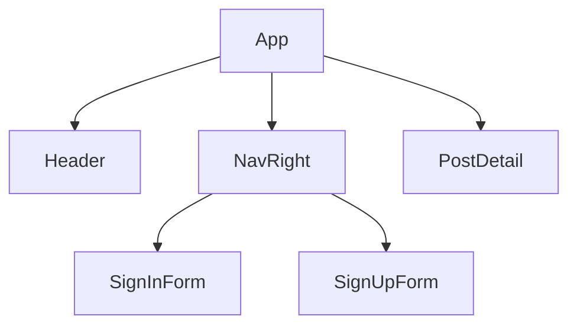
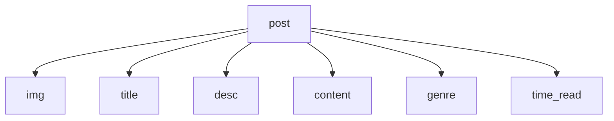

> 1.  save token in local storage
> 1.  form sign in/ sign up
> 1.  transform nav and post when user login or admin log in
> 1.  responsive
> 1.  refactor all code, and deploy

# Components flow

